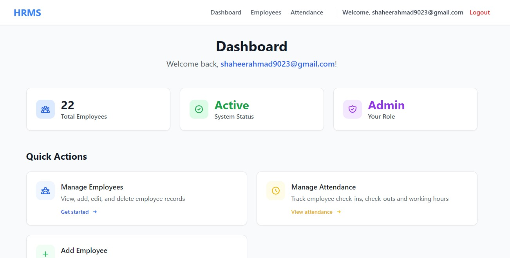
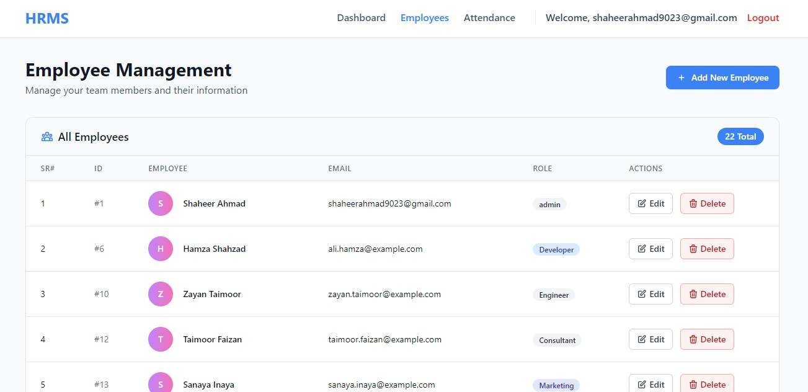
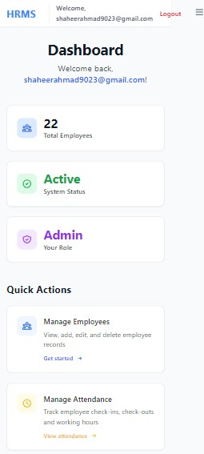

# 🏢 HRMS - Human Resource Management System

[](LICENSE)
[](https://python.org)
[](https://fastapi.tiangolo.com)
[](README.md)
[](mailto:shaheerahmad9023@example.com)

> **⚠️ DEMO VERSION** - This is a showcase repository. The production-ready version with advanced features is available for purchase.

## 📸 Screenshots

### Dashboard


*Modern, responsive dashboard with key metrics and quick actions*

### Employee Management


*Complete employee database with search, filter, and CRUD operations*

### Attendance Tracking


*Real-time attendance tracking with check-in/check-out functionality*

### Mobile Responsive


*Fully responsive design that works on all devices*

## 🚀 Features (Demo Version)

### ✅ Available in Demo

- [X] **User Authentication** - Secure login system
- [X] **Dashboard Overview** - Key metrics visualization
- [X] **Employee Management** - Basic CRUD operations
- [X] **Attendance Tracking** - Daily attendance marking
- [X] **Responsive Design** - Mobile-friendly interface
- [X] **Modern UI/UX** - Clean, professional design

### 🔒 Production Version Only

- [ ] **Advanced Reporting** - Detailed analytics & export options
- [ ] **Role-based Access** - Multiple user roles (Admin, HR, Manager, Employee)
- [ ] **Leave Management** - Leave requests, approvals, balance tracking
- [ ] **Payroll Integration** - Salary calculations, pay slips
- [ ] **Department Management** - Multi-department organization
- [ ] **Notifications** - Email/SMS alerts for important events
- [ ] **Data Export** - PDF reports, Excel exports
- [ ] **API Documentation** - Complete REST API with Swagger
- [ ] **Database Optimization** - Production-grade database setup
- [ ] **Security Features** - Advanced authentication, data encryption

## 🛠️ Technology Stack

| Component                | Technology              | Version  |
| ------------------------ | ----------------------- | -------- |
| **Backend**        | FastAPI                 | 0.104.0+ |
| **Database**       | SQLModel/PostgreSQL     | Latest   |
| **Frontend**       | HTML5, CSS3, JavaScript | Latest   |
| **Styling**        | Tailwind CSS            | 3.0+     |
| **Icons**          | Font Awesome            | 6.0+     |
| **Authentication** | JWT Tokens              | Latest   |
| **Deployment**     | Docker, Nginx           | Latest   |

## 🚦 Quick Start (Demo)


## Requirements

-**Python 3.8+**

```bash

python --version

```

-**Git**

```bash

git --version

```

## Setup Instructions

### 1. Clone the Repository

```bash

git clonehttps://github.com/shaheer9023/Employee_Management_System_.git

cd Employee_Management_System_

```

### 2. Create Virtual Environment

```bash

python -mvenvvenv

```

**Windows:**

```bash

venv\Scripts\activate

```

**Linux/Mac:**

```bash

source venv/bin/activate

```

### 3. Install Dependencies

```bash

pip install-rrequirements.txt

```

### 4. Setup Environment Variables

```bash

copy .env.example.env   # Windows

cp .env.example.env     # Linux/Mac

```

### 5. Run the Demo

```bash

python demo_main.py

```

**Login Credentials:**

```

Username: admin

Password: demo123

```

---

## 📊 Demo Limitations

This demo version includes:

- ⏰ Limited Data: Sample employees and attendance records
- 🔒 Basic Features: Core functionality only
- ⚠️ No Persistence: Data resets on restart
- 📱 Read-only Mode: Some features are view-only

---

## 🏆 Why Choose the Production Version?

### 💼 Business Benefits

- Save **100+ Development Hours** – Ready-to-deploy solution
- Reduce Costs – No need to build from scratch
- Faster Time to Market – Launch your HR system immediately
- Professional Grade – Enterprise-level code quality
- Ongoing Support – Bug fixes and feature updates

### 💰 Pricing Options

**$999** for complete production code with minor customizations (Zip file)

---

## 📞 Get the Production Version

Ready to transform your HR operations?

- 📧 Email: **shaheerahmad9023@gmail.com**
- 💼 LinkedIn: [Shaheer Ahmad](https://www.linkedin.com/in/shaheer9023/)
- 📱 WhatsApp: **+92-3127511011**

---

## 🎯 Perfect For

- 🏢 Small to Medium Businesses
- 🏥 Healthcare Clinics
- 🏫 Educational Institutions
- 🏭 Manufacturing Companies
- 🛍️ Retail Businesses
- 💼 Consulting Firms

---

## 🤝 What You Get (Production Package)

- ✅ Full Source Code – Clean, documented, production-ready
- ✅ Database Schema – Optimized structure
- ✅ Documentation – Installation & usage guides
- ✅ Docker Setup – One-click deployment
- ✅ Zip-File

---

## ⚠️ Important Notes

- 🔒 Demo Code: Not suitable for production use
- ⚖️ License: Demo is for evaluation only
- 🚫 No Redistribution: Cannot be resold or redistributed
- 💡 Learning Purpose: You can learn from the code structure
- 📧 Questions: Contact me for clarifications

---


<p>
    🚀 <strong>Ready to Get Started?</strong><br>
    Transform your HR operations today!
  </p>

<p>
    ⭐ If this demo impressed you, imagine what the production version can do! ⭐
  </p>

<p>
    <sub>Built with ❤️ by <strong>Shaheer Ahmad</strong> | Available for custom development projects</sub>
  </p>
</div>`
